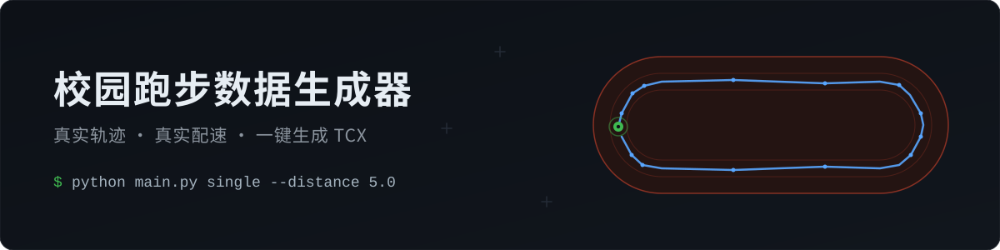

<div align="center">
  
  <p>
    <a href="LICENSE"></a>
    
    <a href="https://github.com/YuShenLiu06/CampusRunning"></a>
  </p>
</div>

>  **免责声明**：本项目仅供学习交流与技术研究所用，请自觉遵守所在学校及运动平台的相关规定。因使用本工具产生的一切后果，由使用者自行承担。

## 天下苦校园跑久矣

早起打卡、里程配速，一样不能少——天下学子苦其久矣。

社区已有不少虚拟定位方案，各有取舍；本工具走了另一条路：**生成带真实操场轨迹与真实配速的 TCX 文件，导入运动软件即可使用**。

作者坚持为爱发电，愿普度天下苦校园跑的学子。若这个项目帮到了你，点亮 Star 便是对作者最好的鼓励 。

## 它能做什么

三种生成模式，覆盖从「补一次记录」到「整学期一次配齐」：

| 模式 | 命令 | 适用场景 |
|------|------|----------|
| 每日范围 | `daily` | 给定日期区间，每天在公里数范围内随机生成 |
| 总公里数 | `total` | 给定总里程，自动分配到每天（周末可为平日 1.5 倍，支持每周休息日） |
| 单文件 | `single` | 为特定日期补一条指定里程的记录 |

每条记录由四层机制撑起「真实感」：

- **真实轨迹**——基于操场坐标生成顺时针 GPS 轨迹点，内置多条校园轨迹，也可自行添加
- **真实配速**——热身 → 稳定 → 疲劳 → 冲刺四阶段配速波动，拒绝匀速直线
- **坐标修正**——GCJ-02 系统性偏移自动校正，轨迹落在它该在的位置
- **可视化轨迹编辑器**——Web 内在高德地图上标点绘制轨迹，一键保存为配置

CLI 与 Web 双入口，生成结果一致。

## 快速开始

要求 Python 3.13+。

### CLI

```bash
# 最快验证：生成一次 5 km 记录
python main.py single --date 2025-01-01 --distance 5.0

# 整月按每日范围生成
python main.py daily --start-date 2025-01-01 --end-date 2025-01-31 --min-km 2 --max-km 5

# 目标 100 km，自动分配到每天
python main.py total --start-date 2025-01-01 --end-date 2025-01-31 --total-km 100

# 组合：模板 + 指定轨迹 + 打包 ZIP
python main.py daily --template easy_run --track campus_default --zip \
  --start-date 2025-01-01 --end-date 2025-01-07 --min-km 2 --max-km 5

# 查看可用轨迹 / 模板 / 完整参数
python main.py --list-tracks
python main.py --list-templates
```

完整参数说明见 [API 参考](docs/api_reference.md)。

### Web

```bash
pip install flask
python app.py    # 浏览器访问 http://127.0.0.1:5000
```

表单化操作，支持模板保存与应用、轨迹编辑器、结果 ZIP 下载。

### 导入手机

生成结果如何导入 Keep，见 [Keep 导入教程（含截图）](guied.md)。TCX 是通用格式，Garmin Training Center、GoldenCheetah、Strava 等软件也可直接打开。

## 配置

### 添加轨迹

**方式一：Web 轨迹编辑器（推荐）**——启动 Web 后从首页进入「轨迹编辑器」，在高德地图上标点绘制轨迹、实时查看环线距离，保存后直接写入 `config/tracks/`，无需手工拾取坐标。「官方」地图档需要配置高德 JS API Key，申请步骤见[高德 Key 申请教程](docs/amap_key_guide.md)。

**方式二：手工编辑 JSON**——在 `config/tracks/` 下新建文件：

```json
{
  "id": "my_track",
  "name": "我的轨迹",
  "description": "操场跑道",
  "base_coordinates": [
    {"longitude": 106.6591, "latitude": 26.4513},
    {"longitude": 106.6590, "latitude": 26.4516}
  ],
  "coordinate_correction": {
    "current_center": {"longitude": 106.6594, "latitude": 26.4518},
    "target_center": {"longitude": 106.6630, "latitude": 26.4482}
  }
}
```

本项目使用**高德坐标系（GCJ-02）**。`coordinate_correction` 中的 `current_center` 是轨迹坐标自身的中心点，`target_center` 是该轨迹在地图上的实际位置中心——只需填入高德坐标的实际值，系统会自动完成偏移校正。字段说明见[轨迹配置格式](docs/track_format.md)。

### 使用模板

模板把配速、里程、休息日等常用配置存成 JSON，一键复用：

- **Web 内创建**：填好表单 → 「导出模板」→ 命名下载
- **手工创建**：放入 `config/templates/`，格式见[模板创建指南](config/templates/TEMPLATE_GUIDE.md)
- **应用**：CLI 加 `--template easy_run`，或在 Web 中下拉选择

## 项目结构

| 位置 | 职责 |
|------|------|
| `main.py` / `app.py` | CLI 与 Web 入口 |
| `src/core/` | 轨迹分析与生成、配速波动、坐标修正、数据模型 |
| `src/planners/` | 各生成模式的距离规划策略 |
| `src/exporters/` | TCX 导出（接口抽象，可扩展 GPX / FIT） |
| `src/*.py` | 配置管理、模板管理、生成引擎编排 |
| `web/` | Flask 路由、页面与静态资源 |
| `config/` | 轨迹定义、预设模板、默认设置 |

架构与数据流详见[架构说明](docs/architecture.md)。

## 文档

- [架构说明](docs/architecture.md)
- [轨迹配置格式](docs/track_format.md)
- [API 参考](docs/api_reference.md)
- [模板创建指南](config/templates/TEMPLATE_GUIDE.md)
- [高德 Key 申请教程](docs/amap_key_guide.md)
- [Keep 导入教程](guied.md)

## 许可

[MIT](LICENSE) © YuShen

为爱发电，普度众生。若这个项目替你跑过一公里，欢迎点亮 Star ；Issue 与 PR 一律欢迎。
